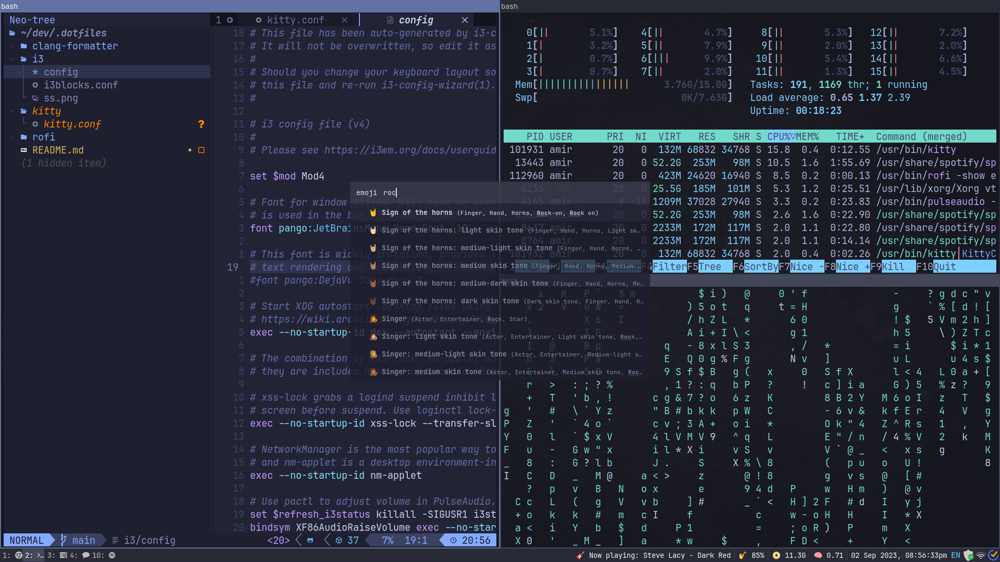

# 🏠 My Dotfiles

Hello there! 👋
These are my dotfiles that I use to customize and configure my development environment. Feel free to fork, edit and use my dotfiles for your own needs.
- PS: dotfiles are configuration files starting with a dot (e.g., `.bashrc`, `.vimrc`).

## 🧰 Tools and Configurations
### Window Manager (i3)
Features:
* adjusted keybindings to match vim keybindings
* used new color scheme
* used i3blocks instead of i3status
* riced up the new bar
* added a new wallpaper
* added compton for tansparency and transitions
* added keybindings for volume and media controls
* made startup apps and defulat workspaces for most used apps
* switch to rofi for app launcher

 

### rofi (app launcher)
* app launcher
* emoji picker

 
 

### Shell (Bash + Zsh + Nu Shell)
will be added in the future.

### Editor (NeoVim)
will be added in the future.

### Version Control (Git)
will be added in the future.

### Terminals 
## kitty
Kitty is a terminal emulator that is very customizable and has a lot of features. I use it as my main terminal emulator in ubuntu. It is very fast and has a lot of features.
Configured with tokyo night theme.

### Fonts (Nerd Fonts)

__Nerd Fonts__ are fonts that have a lot of extra glyphs added to them. These extra glyphs are used to display icons in the terminal. This allows for more customizations without the need for any external programs.__

I use the nerd font JetBrains Nerd Font Mono

### Window Manger (bugn)
will be added in the future.

### C formatter (clang-format)
Made to match the style of coding used in ALX africa and Betty.
